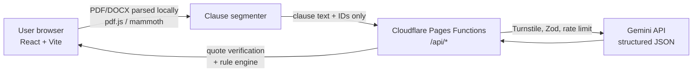

# SignSure

**Understand every clause before you sign.**

SignSure helps first-time job seekers in India understand their offer letter and employment contract *before* they sign it. It explains each clause in plain language (English or an Indian language), flags risky or possibly unenforceable terms, and answers questions **only** from the document itself, showing the exact clause and page next to every answer so the user can check it.

> ⚖️ SignSure provides legal *information*, not legal advice. It helps you understand your document and prepare the right questions for a qualified lawyer.

---

## The problem

Having a contract is not the same as understanding it. A 22-year-old signing their first offer letter usually has 2–3 days to accept, no lawyer, and a document full of phrases like *"liquidated damages"*, *"restraint"*, and *"notwithstanding anything contained herein"*. The clauses that hurt most (a 90-day notice period, a ₹2 lakh training bond, a 2-year non-compete) are often buried on page 4.

## Who it's for

**Primary user:** an Indian first-job employee or early-career job switcher (age ~21–27) who has received an offer letter or employment agreement and must decide whether to sign.

**What they worry about:** notice period, training bonds and exit penalties, non-compete clauses, real take-home salary, probation, termination terms, and what to negotiate.

## Why not just paste it into a chatbot?

| General AI chatbot | SignSure |
|---|---|
| Fluent answers you can't easily check | Every claim is linked to a clause number + page, with the original text shown side by side |
| May guess when the document is silent | Says **"This document doesn't say"** and tells you what to ask instead |
| Citations can be invented | Quotes are **verified by code** against the source text; unverified claims are hidden or marked |
| Generic legal knowledge | India-specific rule library (Indian Contract Act s.27 & s.74, Labour Codes 2025, gratuity, PF) applied deterministically |
| A chat transcript | A structured report, a signing checklist, and a "questions for your lawyer" sheet |
| Your document may be stored | Parsed in your browser; nothing is stored on our servers |

## Features

- **Clause map** – the document split into numbered clauses with page references, each with a plain-language explanation and a risk level.
- **Concern lenses** – "I might quit early", "Future jobs", "My salary", "Getting fired" re-rank the report around what you care about.
- **Red flags with Indian legal context** – deterministic rules flag things like post-employment non-competes and heavy bond penalties.
- **Grounded Q&A** – ask anything; answers cite verified clauses or explicitly say the document doesn't cover it.
- **Compare two versions** – see what changed between an old and a revised offer.
- **Lawyer prep sheet** – exportable list of open questions, missing information, and documents to bring.
- **Accessible by design** – WCAG 2.2 AA target, keyboard-first, screen-reader friendly, reading-level toggle, read-aloud, English + Hindi (+ more).

## Architecture at a glance



The model never invents page numbers: it returns **clause IDs + quotes**, and the server resolves IDs to pages and verifies each quote exists in that clause. See [`docs/ARCHITECTURE.md`](docs/ARCHITECTURE.md).

## Tech stack

React 19 · Vite · TypeScript (strict) · Tailwind CSS · Zod · Google Gemini API (`@google/genai`) · Cloudflare Pages + Pages Functions · Workers KV · Cloudflare Turnstile · pdf.js · mammoth · Vitest · React Testing Library · Playwright · axe-core · GitHub Actions

## Quick start

```bash
npm install
cp .dev.vars.example .dev.vars      # add GEMINI_API_KEY etc.
npm run dev                          # frontend (Vite) on :5173, proxies /api to :8788
npm run dev:api                      # Pages Functions via wrangler on :8788
```

Set `MOCK_GEMINI=true` in `.dev.vars` to run fully offline with fixture responses.

| Script | Purpose |
|---|---|
| `npm run lint` | ESLint (incl. jsx-a11y) |
| `npm run typecheck` | `tsc --noEmit` |
| `npm test` | Unit + component tests (Vitest) |
| `npm run test:e2e` | Playwright end-to-end + axe accessibility |
| `npm run eval` | Golden-set evaluation against the real Gemini API |
| `npm run build` | Production build |

## How this project maps to the judging criteria

| Criterion | Where to look |
|---|---|
| Problem statement alignment | This README, [`docs/PRD.md`](docs/PRD.md) |
| Code quality | Strict TS, layered structure, [`CLAUDE.md`](CLAUDE.md) conventions |
| Security | [`docs/SECURITY.md`](docs/SECURITY.md), `functions/_middleware.ts`, `public/_headers` |
| Efficiency | [`docs/ARCHITECTURE.md#performance-budgets`](docs/ARCHITECTURE.md) |
| Testing | [`docs/TESTING.md`](docs/TESTING.md), `tests/`, `e2e/`, CI workflow |
| Accessibility | [`docs/ACCESSIBILITY.md`](docs/ACCESSIBILITY.md) |

## Documentation

- [`docs/PRD.md`](docs/PRD.md) – users, problems, features, acceptance criteria
- [`docs/ARCHITECTURE.md`](docs/ARCHITECTURE.md) – system design, API contracts, folder structure
- [`docs/AI_PIPELINE.md`](docs/AI_PIPELINE.md) – Gemini prompts, schemas, verification
- [`docs/LEGAL_RULES.md`](docs/LEGAL_RULES.md) – India employment rule library
- [`docs/UX_FLOW.md`](docs/UX_FLOW.md) – screens and interaction design
- [`docs/SECURITY.md`](docs/SECURITY.md) · [`docs/TESTING.md`](docs/TESTING.md) · [`docs/ACCESSIBILITY.md`](docs/ACCESSIBILITY.md)
- [`docs/DEPLOYMENT.md`](docs/DEPLOYMENT.md) – Cloudflare Pages setup
- [`docs/PROJECT_PLAN.md`](docs/PROJECT_PLAN.md) – phased build planner
- [`docs/SUBMISSION.md`](docs/SUBMISSION.md) – demo script, blog and post outlines, final checklist

## Disclaimer

SignSure is an educational tool. It does not create a lawyer–client relationship, and its output may be incomplete or wrong. Laws differ by state and change over time. Always consult a qualified advocate before relying on any interpretation.
