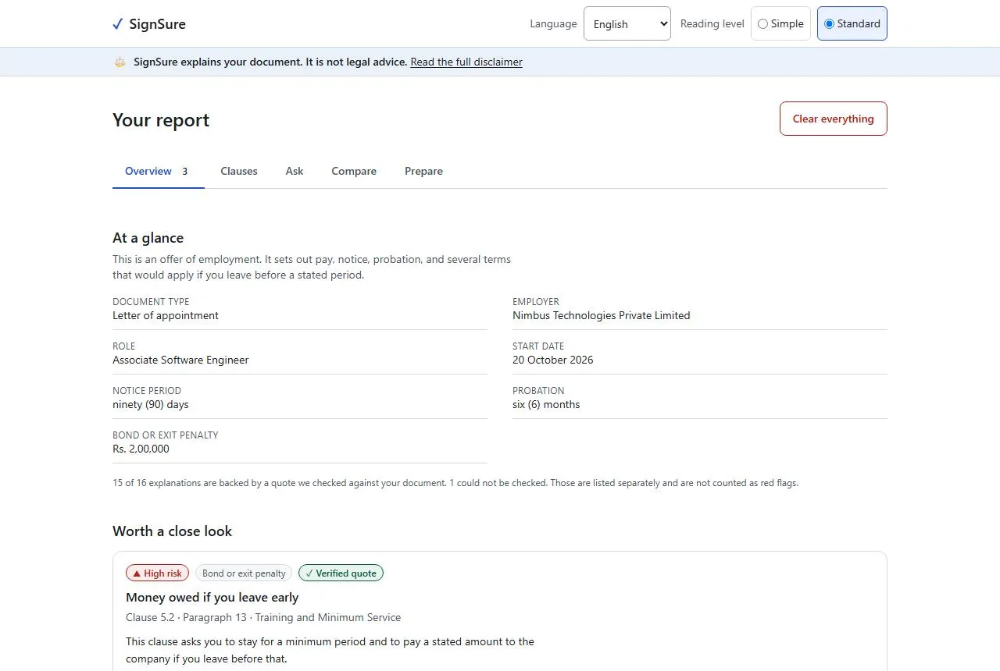
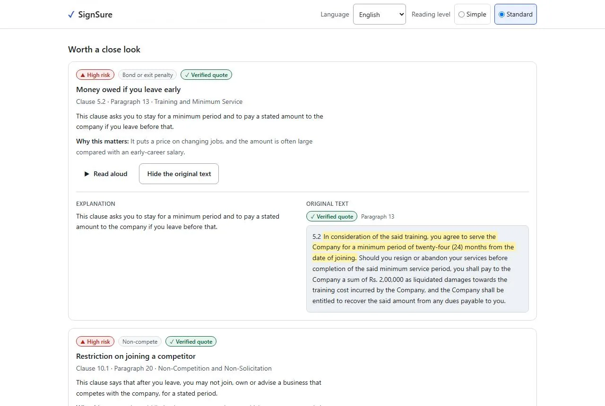
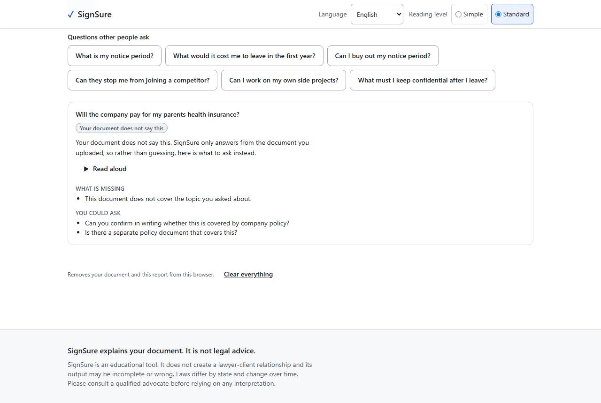
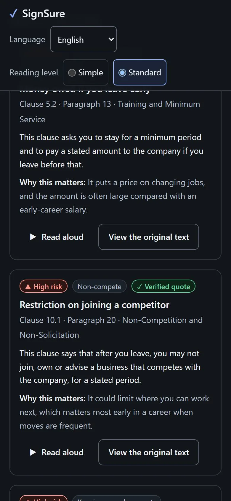
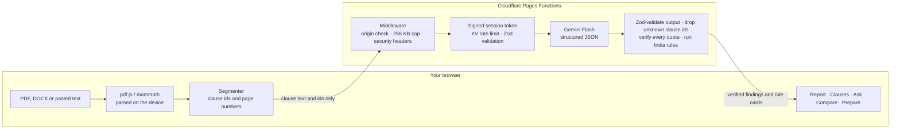

# SignSure

**Understand every clause before you sign.**

[](https://github.com/Mirdula18/SignSure/actions/workflows/ci.yml)

SignSure helps first-time job seekers in India understand their offer letter or employment agreement *before* they sign it. It explains each clause in plain English or Hindi, flags terms worth a closer look using a reviewed India rule library, and answers questions **only** from the document, showing the exact clause and page next to every answer so the reader can check it.

> ⚖️ SignSure provides legal *information*, not legal advice. It helps you understand your document and prepare the right questions for a qualified lawyer.

**Live app:** _added after deployment_ · **Try it without a file:** press *Try with a sample offer letter*.

| Report | Every claim beside its source |
|---|---|
|  |  |
| **Says when the document is silent** | **On a phone, in dark mode** |
|  |  |

<sub>Screenshots use the built-in synthetic sample letter in mock mode.</sub>

---

## The problem

Having a contract is not the same as understanding it. A 22-year-old signing their first offer letter usually has two or three days to accept, no lawyer, and a document full of phrases like *"liquidated damages"*, *"restraint"* and *"notwithstanding anything contained herein"*. The clauses that cost the most (a 90-day notice period, a ₹2 lakh training bond, a two-year non-compete, original certificates kept by the employer) are often on page 4.

**Who it is for:** Indian first-job employees and early-career job switchers (about 21–27) deciding whether to sign. They worry about notice periods, bonds and exit penalties, non-competes, real take-home pay, probation and termination, and what they can reasonably ask to change.

## Why not just paste it into a chatbot?

| General AI chatbot | SignSure |
|---|---|
| Fluent answers you can't easily check | Every explanation is tied to a clause number and page, with the original text shown beside it |
| May guess when the document is silent | Says **"Your document does not say this"** and suggests what to ask instead |
| Citations can be invented | Every quote is **checked by code** against the clause it cites; anything that fails is set apart and never counted as a red flag |
| Generic legal knowledge | A reviewed India rule library (Indian Contract Act ss.27 and 74, Code on Wages 2019, gratuity, notice, bonds, document retention) applied by code, not by the model |
| A chat transcript | A structured report, a clause-by-clause view, a version comparison and a sheet of questions for HR or a lawyer |
| Your document may be kept | Files are read in your browser; only clause text is sent for analysis, and nothing is stored |

## How it works



**Code decides, the model explains.** The model returns clause ids and quotes, never page numbers: pages come from our own parse. Each quote is checked against the clause it claims to come from (`shared/verify.ts`), an "answered" reply with no verified citation is downgraded to "not in the document", and rule-card text comes from `shared/rules`, never from the model. Document and question text are fenced as untrusted data in every prompt. Details are in [`docs/ARCHITECTURE.md`](docs/ARCHITECTURE.md) and [`docs/AI_PIPELINE.md`](docs/AI_PIPELINE.md).

## Features

- **Clause map:** every clause of the document, in order, under its section heading. Clauses SignSure has something to say about carry an explanation, a risk level and a verification badge; the rest show their own text, so the whole document can be read in one place.
- **Concern lenses:** "I might quit early", "My next job", "My salary" and "Being let go" re-rank the report around what the reader cares about.
- **India rule library:** 16 deterministic rules (post-employment non-competes, bonds and liquidated damages, asymmetric or long notice, document retention, clawbacks, unilateral changes, the 50% wages rule and more) plus 6 checks for information a letter should state but doesn't.
- **Grounded Q&A:** answers cite verified clauses, or say plainly that the document does not cover the question.
- **Compare two versions:** clauses are paired by code, and the model explains only the pairs it is given.
- **Prepare sheet:** a signing checklist, questions for HR and for a lawyer, missing information and documents to bring, exportable as Markdown or printable.
- **Accessible by design:** WCAG 2.2 AA target, keyboard-first, screen-reader friendly (roles, labels and live regions checked in tests), reading-level toggle, read-aloud, inline glossary, English and Hindi.

## Quality at a glance

| | |
|---|---|
| Unit and component tests | **1,638** across 61 files (Vitest, React Testing Library, vitest-axe) |
| End-to-end tests | **84**: 42 journeys, including a real PDF parsed by the pdf.js worker, offline use from the service worker, accessibility and security checks, each on desktop Chromium and a Pixel 7 viewport (Playwright + axe), served with the production CSP and headers |
| Coverage | **99.83%** lines · 99.22% statements · 96.44% branches · 100% functions; **100%** on quote verification, normalisation and the rule library (enforced in CI) |
| Golden set | 6 synthetic contracts with expectations, including a prompt-injection contract; 85 offline checks on every test run |
| Initial JavaScript | **80.3 kB** gzip against a 100 kB budget (enforced in CI), most of it React. The report, Zod, the text parser and the sample letter are prefetched when the browser is idle; the Hindi dictionary loads when Hindi is chosen; pdf.js (minified worker) and mammoth load only when that kind of file is chosen. CI fails if pdf.js, mammoth, Zod, the Hindi dictionary or the sample reaches the first load |
| Offline precache | **141.8 kB** gzip in 15 files, so a return visit opens with no network; the PDF and Word readers are cached on first use instead, and CI fails if either is precached |
| AI calls | One per analysis for letters up to 80 clauses (the sample is 26); questions, comparison and checklist on demand. Identical requests are answered from a cache in the browser and on the server, and a visit may make at most 30 model calls. Follow-up questions start with the unchanged document, so Gemini's implicit context caching can serve it instead of billing it again |
| Quote verification (worst case) | **1.7 ms** for an invented 400-character quote and **~15 ms** for a paraphrased one, in a 4,000-character clause (was 37 ms and 138 ms); identical answers to the plain search, checked by a randomised test |
| Lighthouse (production build, local, 2026-09-22) | Accessibility **100** · Best practices **100** · SEO **100** · Performance 98 desktop, 74–92 mobile (simulated slow 4G, 4× CPU) |
| Security checks | Secret scan, `npm audit` (0 vulnerabilities), CSP pinned by test, 401 / 413 / 429 paths tested end to end |
| Repository | 1.7 MB across 204 tracked files |

## How this project maps to the judging criteria

| Criterion | Evidence |
|---|---|
| **Problem statement alignment** | Built for one audience and one decision: signing an Indian offer letter. Rule texts cite primary sources with review dates ([`docs/LEGAL_RULES.md`](docs/LEGAL_RULES.md)); cautious wording is enforced by tests; the disclaimer is on every screen. |
| **Code quality** | TypeScript strict (`noUncheckedIndexedAccess`, `exactOptionalPropertyTypes`), no `any`, no lint disables; pure logic in `shared/` shared by browser and Workers; every non-obvious choice explained in a short comment beside the code it governs. |
| **Security** | Key only in Functions `env`; HMAC session token bound to a hashed IP; KV rate limits; 256 KB body cap; origin check; CSP with no inline or eval script; prompt fences sanitised; no server logging of document text. Checklist with evidence in [`docs/SECURITY.md`](docs/SECURITY.md) §4. |
| **Efficiency** | Parsing happens on the device; only clause text is sent. First load is 80.3 kB of JavaScript with a 100 kB budget enforced in CI; everything the first screen does not draw is prefetched in idle time ([`src/lazyScreens.ts`](src/lazyScreens.ts)) or loaded on demand, including the Hindi dictionary ([`src/i18n/index.ts`](src/i18n/index.ts)), and long clause lists skip rendering what is off screen. A service worker precaches the 141.8 kB app shell for offline use and caches the parsers on first use, never API responses ([`vite.config.ts`](vite.config.ts), [`e2e/offline.spec.ts`](e2e/offline.spec.ts)). One model call per analysis; identical requests are answered from a cache in the browser and on the server, where simultaneous identical requests share one call ([`functions/lib/responseCache.ts`](functions/lib/responseCache.ts)), and a visit may make at most 30 calls ([`src/api/client.ts`](src/api/client.ts)); follow-up prompts keep the document as a stable prefix for Gemini's implicit caching ([`functions/lib/prompts.ts`](functions/lib/prompts.ts)). Quote verification rules out windows by a word count, then answers every window size from one banded edit-distance table: about 20× faster on an invented quote and 9× on a paraphrased one, with identical answers to the plain search, checked by a randomised test ([`shared/verify.ts`](shared/verify.ts)); clause batches run in a pool, not fixed windows. |
| **Testing** | Unit, component, API-handler, golden-set, E2E and axe layers, run in CI on every push ([`docs/TESTING.md`](docs/TESTING.md)); `npm run eval` scores the live model against the golden set. |
| **Accessibility** | axe on every screen, keyboard-only journey, 320 px reflow and 200% zoom tested end to end; 44 px targets; Hindi interface; reading level; read-aloud ([`docs/ACCESSIBILITY.md`](docs/ACCESSIBILITY.md)). |

## Evaluation

The golden set in [`tests/fixtures/contracts/`](tests/fixtures/contracts) has six synthetic letters: a fair offer, a bond-heavy offer and its revised version, a non-compete-heavy offer, a letter that leaves most things out, and a prompt-injection letter. Each one comes with what a careful reader would expect.

- **Offline, on every test run:** segmentation, all rule flags (and the flags that must *not* fire), extracted amounts and missing-information checks. 85 checks, all passing.
- **Live model:** `npm run eval` sends each contract through the real HTTP API and reports quote verification, refusal accuracy, category and rule recall, citation precision and latency. It fails below 95% verification, below 100% refusal accuracy, or on any injection violation.

| Live eval (Gemini Flash) | Result |
|---|---|
| Quote verification (target ≥ 95%) | _pending first run with a key_ |
| Refusal accuracy (target 100%) | _pending_ |
| Rule recall · category recall | _pending_ |
| Latency p50 / p95 | _pending_ |

## Quick start

Requires Node 20.19 or newer. `npm install` prints `EBADENGINE` warnings for `wrangler`,
`miniflare`, `pdfjs-dist` and `@testing-library/jest-dom`, which all ask for Node 22. They are
warnings, not errors: pdf.js runs in the browser, wrangler and miniflare are only used to deploy
(on Node 22), and the test suite passes on 20.19. CI runs Node 22.

```bash
npm install
cp .dev.vars.example .dev.vars   # MOCK_GEMINI=true by default: no key needed
npm run dev                      # app and API together on http://localhost:5173
```

The Pages Functions run inside the Vite dev server (`tools/pagesFunctions.ts`), so the whole stack runs with one command. Mock mode builds realistic responses from your document's own clauses, so verification and the rules behave exactly as they do live. To use the real model, put a Gemini key in `.dev.vars` and set `MOCK_GEMINI=false`. Deployment uses `wrangler`, which needs Node 22: see [`docs/DEPLOYMENT.md`](docs/DEPLOYMENT.md).

| Script | Purpose |
|---|---|
| `npm run dev` | App and API on :5173 |
| `npm run lint` · `npm run typecheck` · `npm run format:check` | ESLint (type-aware, jsx-a11y) · `tsc` for the app, Functions and tooling · Prettier |
| `npm test` · `npm run test:coverage` | Vitest, with coverage thresholds |
| `npm run test:e2e` | Playwright against the production build, desktop and mobile |
| `npm run eval` · `npm run eval -- --mock` | Golden set against the live model · the same harness without a key |
| `npm run build` · `npm run size` | Production build · initial-JS budget check |
| `npm run secretscan` | Fails on anything shaped like a credential in tracked files |
| `npm run deploy` | Build and deploy to Cloudflare Pages (Node 22) |

## Project structure

```
shared/      Pure logic used by browser and Workers: types, Zod schemas, limits,
             quote verification, compare pairing, concern lenses, India rules
functions/   Cloudflare Pages Functions: middleware, /api/{session,analyze,ask,compare,prepare,health},
             Gemini wrapper, prompts, sessions, rate limiting, mock model
src/         React app: upload and parsing, report tabs, session gate, i18n (en, hi), state
tests/       Golden set, eval metrics, header checks
e2e/         Playwright journeys, accessibility and security suites
scripts/     eval, secret scan, bundle budget
tools/       Vite plugin that runs Pages Functions locally
```

## Documentation

- [`docs/PRD.md`](docs/PRD.md): users, problems, features, acceptance criteria
- [`docs/ARCHITECTURE.md`](docs/ARCHITECTURE.md): system design, API contracts, folder structure
- [`docs/AI_PIPELINE.md`](docs/AI_PIPELINE.md): prompts, schemas, verification, evaluation
- [`docs/LEGAL_RULES.md`](docs/LEGAL_RULES.md): the India employment rule library and its sources
- [`docs/UX_FLOW.md`](docs/UX_FLOW.md) · [`docs/ACCESSIBILITY.md`](docs/ACCESSIBILITY.md): screens, interaction and accessibility
- [`docs/SECURITY.md`](docs/SECURITY.md) · [`docs/TESTING.md`](docs/TESTING.md): threat model, checklist, test strategy
- [`docs/DEPLOYMENT.md`](docs/DEPLOYMENT.md): deploying to Cloudflare Pages, and the steps that need an account

## Disclaimer

SignSure is an educational tool. It does not create a lawyer–client relationship, and its output may be incomplete or wrong. Laws differ by state and change over time. Always consult a qualified advocate before relying on any interpretation.
